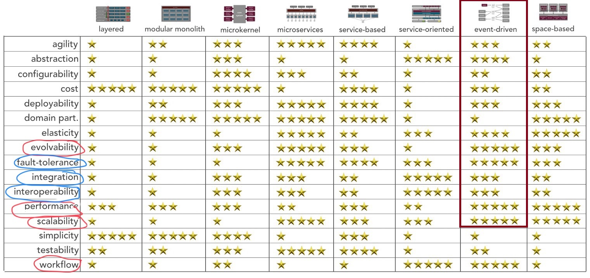
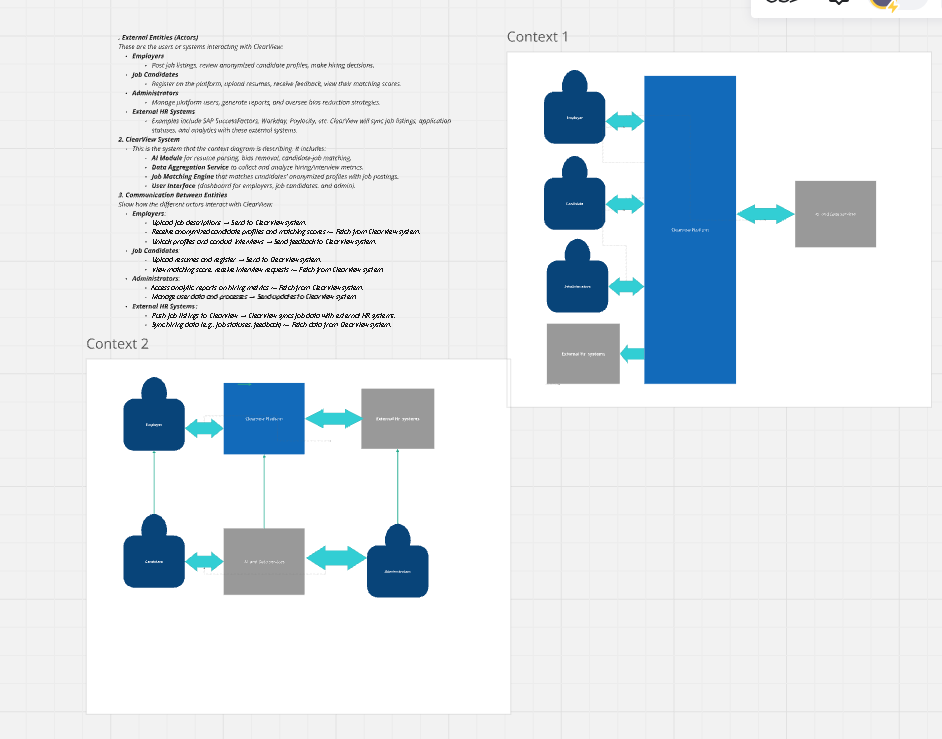

# Architectural Katas Fall - 2024 EquiVisionaries

## Members
- Vaibhav Agarwal [[LinkedIn](https://www.linkedin.com/in/vaibhav-agarwal-39500914/)]
- John Hutchison [[LinkedIn](https://www.linkedin.com/in/john-hutchison-is-awesome/)]
- Yogesh Pekhale [[LinkedIn](https://www.linkedin.com/in/yogeshpekhale/)]
- Sorin Slavescu  [[LinkedIn](https://www.linkedin.com/in/sorin-slavescu/)]


## Table of Contents 
```
1. Introduction
  1.1 Purpose
  1.2 Scope
2. Architecture Analysis
  2.1 Architectural Vision
  2.2 Design Principles
  2.3 Constraints
  2.4 Key Architecture Characteristics
3. Stakeholders
 
4. System Overview
  4.1 Context Diagram
  4.2 System Boundaries
  4.3 Main Components

5. Architectural Views
  5.1 Logical View
  5.2 Physical View
  5.3 Process View
  5.4 Data View
  5.5 Candidate UI
6. Non-Functional Requirements
7. Architectural Risks
```
### 1. **Introduction**

#### **Purpose**

This document presents the architectural design for a platform that connects job candidates with employers. The system allows candidates to submit their CVs, employers to post job specifications, generates anonymised S.M.A.R.T. stories from candidate CVs, matches candidates to job specs, and enables employers to unlock full CVs upon payment. The focus is exclusively on design details, excluding any implementation specifics or technology choices.

#### **Scope**

The architecture covers the following functionalities:

- The platform must leverage AI to re-construct job seeker resumes into a S.M.A.R.T goal format and quantifiable align their experience to open roles posted by the hiring manager.
- Similarity Score/Match with job descriptions is a hard requirement
- AI provided resume tips is a hard requirement
- AI eliminating any potential racial, lifestyle, cultural, etc. indicators is a hard requirement
- Backend process data aggregation is a hard requirement

### 2. **Architectural Goals and Constraints**

#### **Architectural Vision**

Design a secure, scalable, and user-friendly platform that streamlines the recruitment process by anonymising candidate data and efficiently matching them with suitable job opportunities.

#### **Design Principles**

- **Modularity**: Ensure separation of concerns to enhance maintainability and scalability.
- **Security and Privacy**: Prioritise the protection of user data and compliance with data protection regulations.
- **User-Centric Design**: Provide intuitive interfaces and seamless user experiences for both candidates and employers.
- **Sustainability**: The architecture must ensure sustainability by optimising the use of computational resources, especially when utilizing NLP techniques such as LLMs for generating SMART stories and performing matching functions. This includes employing efficient algorithms, scalable solutions, and judicious computational strategies to minimise energy consumption and environmental impact while maintaining performance and accuracy.

#### **Constraints**

- **Regulatory Compliance**: Adhere to data protection laws.
- **Anonymity Requirements**: Maintain candidate confidentiality until authorised disclosure.
- **Resource Limitations**: Design within budgetary and operational constraints.
#### **Key Architecture Characteristics**
| **Characteristic** | **Description**                                                                                                                         | **Why It’s Important for ClearView**                                                                                                    | **Implementation Considerations**                                                                                                                           |
| ----------------- | --------------------------------------------------------------------------------------------------------------------------------------- | --------------------------------------------------------------------------------------------------------------------------------------- | ----------------------------------------------------------------------------------------------------------------------------------------------------------- |
| **Evolvability**  | The system’s ability to be easily modified and extended over time, allowing new features, technologies, or components to be integrated. | ClearView needs to adapt to changing hiring practices, new AI technologies, and updated DEI (Diversity, Equity, Inclusion) regulations. | Use event driven architecture, and version control to allow independent updates and extensions without affecting the core system. |
| **Fault-Tolerance**  | The system’s ability to continue functioning even when one or more components fail. | Ensures that ClearView remains operational during server failures or component crashes, preserving data integrity and user experience. | Ensures that ClearView remains operational during server failures or component crashes, preserving data integrity and user experience. |
| **Integration**  | The ability to connect and exchange information with external systems such as HR platforms (e.g., Workday, SAP SuccessFactors). |ClearView requires seamless data exchange with external HR systems to pull job descriptions and push candidate evaluation reports. | Use RESTful APIs, OAuth2 for secure authentication, and standardized data exchange protocols to support smooth integration with third-party systems. |
| **Interoperability**  | The system’s capability to work across different platforms, services, and tools, enabling communication and cooperation between different systems. | ClearView needs to work across diverse HR platforms, cloud providers, and different operating systems used by employers and candidates. | Use open standards, industry-standard protocols (e.g., HTTP, JSON), and ensure compatibility with various HR systems and cloud providers. |
| **Performace**  | TThe system’s ability to execute tasks quickly and efficiently, ensuring low latency and high responsiveness for all users (employers, candidates). | High performance is crucial for user satisfaction, especially when processing large datasets like resumes, job listings, and candidate assessments in real time. | Optimize AI processing, use caching for frequently accessed data, and implement efficient algorithms for resume parsing and job matching. |
| **Scalability**  | The ability to grow and manage increasing demand, ensuring that system performance remains stable as the number of users or data volume increases. | ClearView should handle growing amounts of job postings, candidates, and feedback data without impacting system performance. | Use cloud services (AWS, Azure) with auto-scaling capabilities, and adopt stateless services with horizontal scaling for heavy AI processing tasks. |
| **Workflow**  | The definition and automation of the series of tasks or processes (e.g., resume uploads, profile anonymization, interview feedback).. | Effective workflow ensures that all users (candidates, employers, admins) can follow clear steps and easily interact with the system’s features. | Design workflows that automate processes like resume parsing, bias detection, and candidate feedback collection, using state machines or workflow engines. |



### 3. **Stakeholders**

- **Candidates**: Individuals seeking employment opportunities.
- **Employers**: Organizations looking to hire suitable candidates.
- **Administrators**: Personnel responsible for managing and maintaining the platform.

### 4. **System Overview**

#### **Context Diagram**

The system interacts with external entities such as candidates, employers, payment services, other HR systems, and LLM service providers.

#### **System Boundaries**

- **Included**: All functionalities related to CV submission, job specification submission, S.M.A.R.T. story generation, matching, communication with employers, and payment processing.
- **Excluded**: External job boards, third-party recruitment agencies, and any services not directly related to the core functionalities.

#### **Main Components**

- **User Interface Module**
  - Candidate Dashboard
  - Employer Dashboard
  - Admin Dashboard
- **Resume Service**
- **Resume Tips Service**
- **Job Service**
- **S.M.A.R.T. Story Generation Service**
- **Matching Engine**
- **HR Integration**
- **Payment Processing Service**
- **Notification Service**
- **Analytics Platform**
- **Storage Facility**
- **IAM**
- **Message Broker**
- **Observability Platform**

### 5. **Architectural Views**

#### **5.1 Logical View**

**Component Overview**

- **User Interface Module**: Facilitates interactions between users (candidates, employers, administrators) and the system.
- **Resume Service**: Manages the submission and storage of resumes by candidates. Generates events for new or updated resume.
- **S.M.A.R.T. Story Generation Service**: Facility to create S.M.A.R.T. stories describing each candidate that submits a new or updated CV. Uses AI (LLMs) to generate these stories.
- **Resume Tips Generator**: Component to generate improvements tips for a new resume added to the system.
- **Job Service**: Manages the submission and storage of job specifications by employers.
- **Matching Engine**: Compares S.M.A.R.T. stories with job specifications to identify suitable matches. Uses AI (LLMs) to best identify stories that match the job requirements
- **HR Integration**: Abstraction layer to enable integraiton of HR Systems. Subscribes to specific Events and provides a unique interface through which the ClearView System plugs any external HR system in
- **Payment Processing Service**: Manages transactions for employers to unlock full CVs.
- **Notification Service**: Sends communications to employers regarding matches, to candidates regarding unlocking events, and other relevant notifications.
- **Analytics Platform**: Facility to manage business reporting.
- **Storage Facility**: Stores resumes, job specifications, S.M.A.R.T. stories securely.
- **IAM**: Oversees authentication, authorization, and other access management concerns.
- **Message Broker**: The faiclity that provides Pub/Sub implementation to allow events to be published and consumed by application components
- **Observability Platform**: Monitoring, logging, alerting, etc.

**Interactions and Responsibilities**

1. **Resume Submission**: Candidates submit their CVs via the Candidate Dashboard, which are then stored by the Resume Service. A new Resume Event is generated containing the candidate ID, resume location, etc. 
2. **S.M.A.R.T. Story Generation**: This component subscribes to Resume Events. It collects the new or updated resume and generates a new S.M.A.R.T. story for the specific candidate. Stores the S.M.A.R.T. story in the appropriate location and then generates SMARTStory Event, which contains the candidate ID and SMART story location. The SMARTStory Event will be consumed by the notification service to inform the candidate that a new SMART Story is available. A more detailed description of the S.M.A.R.T. Story generation process can be found in the [[detailed requirement design document here](./docs/smartstoryreq/smartstory.md)] 
3. **Resume Tips Generation**:  This component consumes the Resume Events and produces resume improvements tips from a Generative Pretrained Transformer (LLM) based on a well crafted Prompt and the original resume. A more detailed description of the Tips Generation process can be found in the [[detailed requirement design document here](./docs/tipsreq/tipsgen.md)] 
3. **Job Spec Submission**: Employers submit job specifications through the Employer Dashboard, which are then stored by the Job Service. A new Job Event is generated containing the Employer ID, Job ID, Job location, etc.
4. **Matching**: The Matching Engine compares Resumes with Job specs to find potential matches. It subscribes to Job and Resume Events and produces Matcher Events containing the Resume ID, Job ID and a score, one event per match. The Job Service subscribes to Matcher Events and updates the Job ID with the Resume ID from the Event. If the Resume Event started the Matching process the Matching process goes through all unfilled Jobs and produces a matching score against the new Resume. Matches above a configureable score threshold are then published as Matcher events. Similarly for new Job events the component finds the Resumes that match the Job description with a score over an accepted threashold. A more detailed description of the Matching process can be found in the [[detailed requirement design document here](./docs/matcherreq/matcher.md)] 
5. **Communication**: The Notification Module informs employers of potential matches. It can also be configured to inform candidates if necessary. It is subscribing to Matcher, Job, Resume, SMARTStory events and produces notifications as required.
6. **Payment and Access**: Employers use the Payment Service to unlock full CVs, which are then accessible via the Employer Dashboard. The Employers dashboard queries the Resume Service to request all accessible CVs. Using this information for each Job and available Matches, the Employer Dashboard will provide links to accessible Resumes.

#### **5.2 Physical View**

**Deployment Considerations**

- The system is designed to operate across multiple servers or cloud instances to ensure scalability and availability.
- Separation of concerns is maintained by deploying different modules on dedicated resources as needed.
- Data storage is managed securely, with appropriate measures for backup and recovery.

#### **5.3 Process View**

**Concurrency and Parallelism**

- The system supports concurrent access by multiple users, handling simultaneous CV submissions, job spec postings, and match processing.
- Background processes handle resource-intensive tasks like CV parsing and matching to ensure responsive user interfaces.

**Communication Mechanisms**

- Modules communicate through well-defined events, utilizing asynchronous messaging. When necesssary and more appropriate the services can communicate via well defined interfaces using synchronous communication but we envisage a prevelant events based integration.
- Events and notifications are managed to keep users informed without overloading the system.

#### **5.4 Data View**

**Data Models**

- **Candidate Data**: Includes CV information, anonymised S.M.A.R.T. stories, application status.
- **Employer Data**: Contains company details, job specifications, transaction history, matches.
- **Transaction Data**: Logs of payments and access permissions.

**Storage Considerations**

- Data integrity and confidentiality are paramount.
- Access controls are enforced to ensure that users can only access authorized information.
- Data retention policies comply with regulatory requirements.

### 6. **Non-Functional Requirements**

#### **Performance**

#### **Scalability**

#### **Security**

#### **Availability and Reliability**

#### **Maintainability**

#### **Usability**

#### **Compliance**

- The system complies with relevant data protection and privacy regulations.
- Payment processes adhere to financial regulations and standards.

### 7. **Architectural Risks**

#### **Identified Risks**

- **Scalability Limitations**: Potential challenges in handling rapid growth.
- **Compliance Violations**: Risk of non-compliance with evolving regulations.
- **Security Threats**: Possibility of new vulnerabilities emerging over time.
- **AI Risks**: Prompt attacks. Gen AI can produce harmful, violent or offensive content. 
