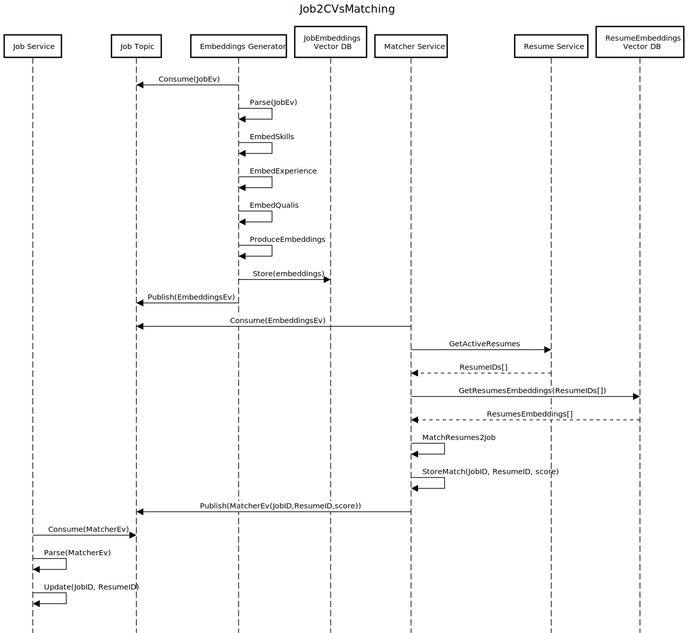
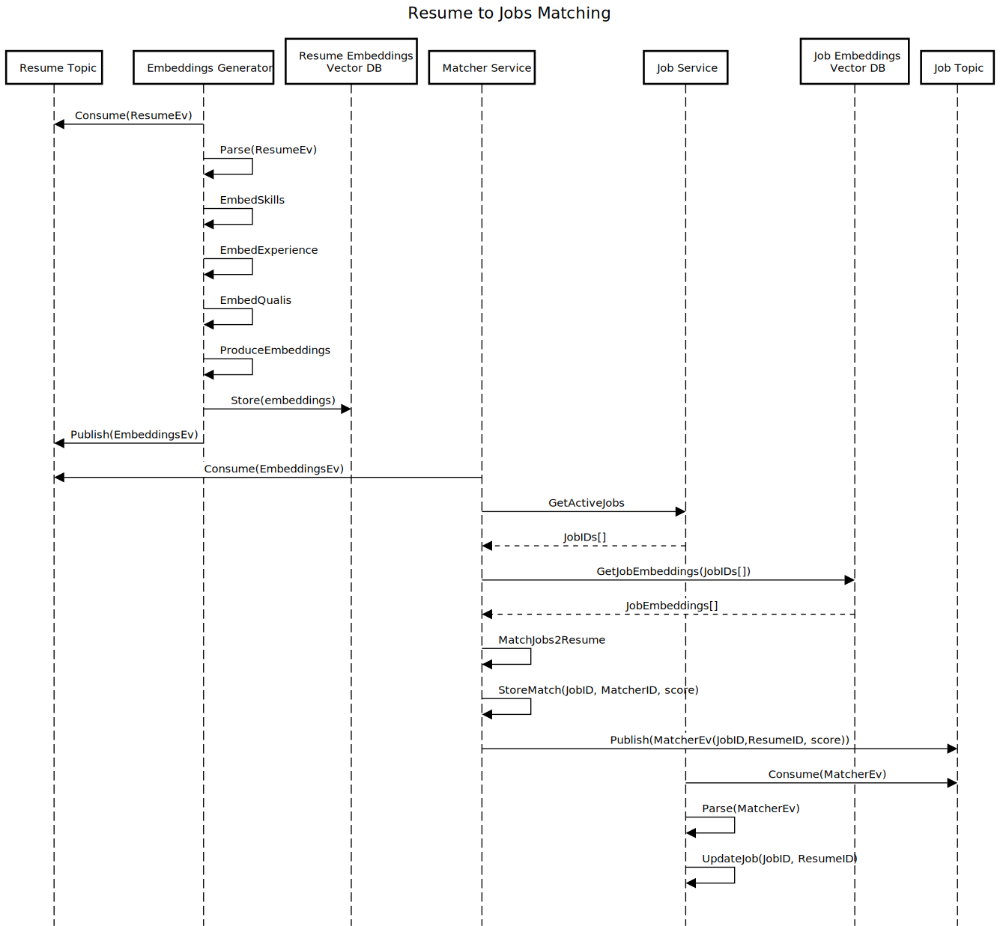

Similarity Score/Match
======================

# Introduction

This document describes the architecture design for the hard requirement of Similarity Score/Match with job descriptions. 

# Design Considerations and Constraints
AI solutions improve at a rapid pace, so we decided to provide a modular design that allows for the solution to evolve by using different NLP algorithms, embeddings models, new components for extra processing (NER, new features), etc. 

We considered that the Job to Resume Matching facility must use original resumes, so that the Transformer based system for extracting embeddings for most relevant skills, qualifications and  experience produces vectors that retain as much of the context as possible.

We have decided to retain Jobs and Resumes Embeddings in separate vector storage facilities so that we allow the extraction and inclusion of additional metadata required for creating complex indices to group resumes and jobs for quicker extraction and parsing.

# Components
- **Embeddings Generator**
- **Job Embeddings Vector DB**
- **Resume Embeddings Vector DB**
- **Matcher Service**

# Sequence Diagram

We have included the Embeddings Generator and the Matching component in one sequence diagram as they are triggered by either a new(updated) resume or job event. The EmbeddingsEv Event mentioned in the diagram may be consumed in the future by other facilities for producing resume tips or for generating S.M.A.R.T. stories. In the current design we decided to use and external LLM service to help generating those elements.

We have decided to retain the JobID, ResumeID and matching score within a separate Matches database for future improvements of the matching algorithm

There are 2 Sequence diagrams one describing the process when a new Job event is consumed (Job2ResMatch) and the other one when a new Resume event is consumed (Res2JobMatch)

