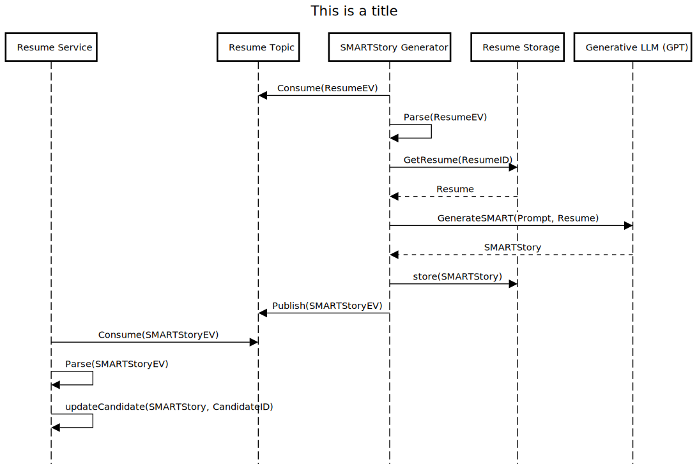

Candidate S.M.A.R.T. Story
==========================

# Introduction
This document describes the architectural design to implement the first hard requirement.
> The platform must leverage AI to re-construct job seeker resumes into a S.M.A.R.T goal format and quantifiable align their experience to open roles posted by the hiring manager.

# Components

- **SMARTStoryGenerator**
This component is the one that consumes a new Resume event, extracts the resume from the storage, appends it to a well crafted prompt for generating the SMART story and rthen calls an external Generative LLM (Generaive Pretrained Transformer) to generate a SMART story for the given Resume. Once the story is returned it is then published as a new SMARTStory Event which will then be consumed by the Resume Service to update the candidate record. This event can also be consumed by the Notification service to provide an update to the candidate that the new SMART story is available.

- **Generative LLM(GPT)**
This is an external component, an externally hosted Generative Pretrained Transformer that can generate SMART stories given a well crafted prompt and an original CV. The anonymisation part will be done by the prompt, which will include directives for the LLM to produce a result that doesn't contain any PII or organisational data.

# Future Improvements
We have taken the approach to call an external GPT for generating the SMART story because it will be a very quick way to fulfill this requirement. We are aware that abetter solution will be to use the embeddings generated by the Embeddings Generator component and then align them with the elements of a SMART story. We can use the Generation LLM to use the extracted embeddings for skills, experiences and qualifications only. This should provide a more tailored and acceptable result.

# Sequence Diagram

The below sequence diagram captures the process to produce a SMART story based on an event

