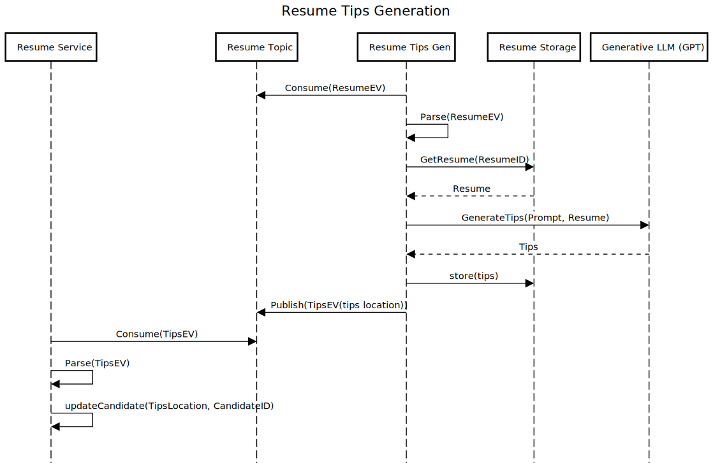

Resume Tips Generation
==========================

# Introduction
This document describes the architectural design to implement the hard requirement regarding Resume Tips.
> AI provided resume tips is a hard requirement

# Components

- **Resume Tips Generator**
This component is the one that consumes a new Resume event, extracts the resume from the storage, appends it to a well crafted prompt for generating improvement tips and then calls an external Generative LLM (Generaive Pretrained Transformer) to generate the improvement tips for the given Resume. Once the tips are returned a new Tips Event is publsihed, which will then be consumed by the Resume Service to update the candidate record. This event can also be consumed by the Notification service to provide an update to the candidate that the new Tips are available.

- **Generative LLM(GPT)**
This is an external component, an externally hosted Generative Pretrained Transformer that can generate resume tips given a well crafted prompt and an original CV. The anonymisation part will be done by the prompt, which will include directives for the LLM to produce a result that doesn't contain any PII or organisational data.

# Future Improvements
We have taken the approach to call an external GPT for generating the tips because it will be a very quick way to fulfill this requirement at the beginning. We are aware that a better solution will be to use the embeddings generated by the Embeddings Generator component and then individually generate tips based on these embeddings. We can use the Generation LLM to use the extracted embeddings for skills, experiences and qualifications only. This should provide a more tailored and acceptable result.

# Sequence Diagram

The below sequence diagram captures the process to produce a SMART story based on an event

